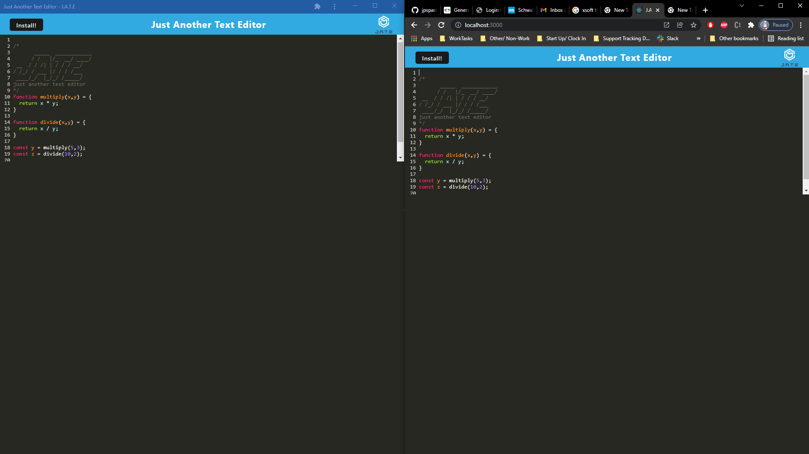

# Just Another Text Editor

## Badges

## Description
This assignment is to help show the understanding of webpacks and service workers. Being able to install an application on your local machine with a webpack and to be able to cache data offline with a service worker

## Table of Contents
-[Installation](#installation)

-[Usage](#usage)

-[Contributions](#contributions)

-[Test](#test)

-[License](#license)

-[Questions](#questions)

## Installation
Download the application to your local machine. Then run `npm install` to get all dependencies. Then run `npm run build` to build the application with webpack. Then run `npm run start:dev` to spin up a server. Lastly visit localhost:3000 in your web browser to utilize the application.

## Usage
This app is simply used as a text editor with in your browser. Allows you to use an IDE within your browser to write basic code via Javscript

## Contributions
Joseph Spann, UCSD_Bootcamp

## Test
N/A

## License
[License Information Found Here](https://choosealicense.com/licenses/mit/)

## Questions
GitHub: https://github.com/jpspann91

Contact Me: joespann91@gmail.com

## Screenshot

## Heroku Deployment
Heroku Deployment Here: (https://week-19-jate-app.herokuapp.com/)
